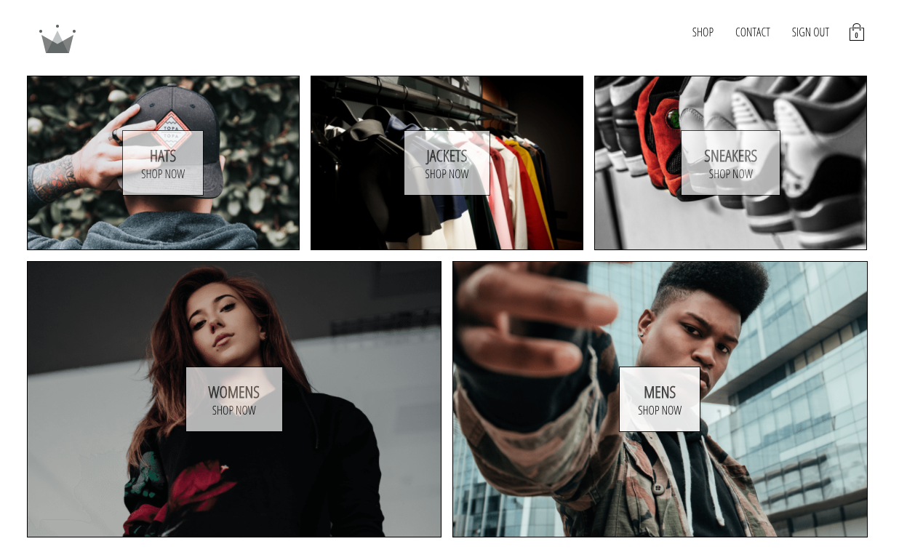

### React e-commerce project with GraphQL

## Description

This project is a clone of this one: [CROWN_CONTEXT](https://github.com/for-alisia/crown-context)
But in this project I used Apollo and GraphQL as a state manager to handle al the data in this application. It's just another example of state management in React Apps.

## Installation

1. git clone https://github.com/for-alisia/crown-apollo.git
2. cd crown-apollo
3. npm install
4. npm start

# Other information

Created with create-react-app.

# Author

Romanova Elena, Fullstack Javascript Developer, 2020
